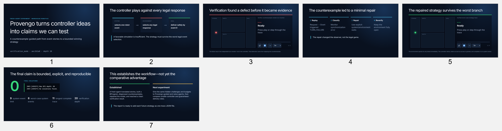

# Provengo Smart Agent Controller Demonstration

This repository is an experimental demonstration of an AI agent using Behavioral Programming and Provengo verification to design a controller for an adversarial robotics problem.

The central research question is:

> Under equal development constraints, can a Provengo-guided agent produce safer and more robust controllers than an otherwise identical agent working without Provengo?

This first benchmark establishes the Provengo-guided workflow. A fresh agent translated event stories into a BProgram, devised a causal controller strategy, ran formal verification, diagnosed verifier counterexamples, repaired the model, and verified again.

[**Launch the live interactive presentation →**](https://provengo.github.io/SmartAgent/)<br>
[**Open the evidence report →**](report/README.md)



## Verified result

The final controller passed bounded formal verification:

```text
INFO [VERIFY] Max DFS depth: 20
INFO [VERIFY] No violations found.
```

The longest complete play contains 11 selected events, while verification explored to depth 20.

| Measure | Result |
|---|---:|
| Controller limit | 9 system events |
| Worst-case strategy | 6 system events |
| Longest complete play | 11 selected events |
| Verification depth | 20 |
| Final violations | 0 |

## Repository portal

### Interactive report

- [Live Slidev presentation](https://provengo.github.io/SmartAgent/)
- [Report and reproducibility guide](report/README.md)
- [Slidev deck](report/slides.md)
- [Interactive trace player](report/components/WarehouseTrace.vue)
- [Monitor-failure trace](report/public/traces/monitor-failure.json)
- [Verified success trace](report/public/traces/verified-success.json)

### Controller-planning skill

- [Skill instructions](skills/provengo-controller-planner/SKILL.md)
- [Warehouse corridor challenge](skills/provengo-controller-planner/references/warehouse-corridor-challenge.md)
- [Codex skill metadata](skills/provengo-controller-planner/agents/openai.yaml)

### Fresh-agent evidence

- [Verified agent report](runs/fresh-agent-002/strategy.md)
- [Final BProgram](runs/fresh-agent-002/warehouse-controller/spec/js/warehouse.js)
- [Successful verification log](runs/fresh-agent-002/verification-repaired.log)
- [Counterexample report](runs/fresh-agent-002/verification-final.html)
- [Initial non-verification run](runs/fresh-agent-001/strategy.md)

## The benchmark

An autonomous warehouse robot must travel from `STAGING` to `GOAL` through one of two forklift-controlled corridors. The controller selects robot events and the environment adversarially selects any response permitted by the stories.

The verified strategy is:

1. Request the `NORTH` corridor.
2. If denied, request `NORTH` again.
3. Enter immediately after a grant.
4. Advance, exit, and deliver.

Only one denial is legal. A mandatory response prevents forklift motion between request and grant or denial, and immediate entry prevents permit recall.

## Counterexample-guided repair

The first executable model produced two verifier counterexamples:

```text
Request(NORTH), Grant(NORTH) -> TURN_FAILURE
Request(NORTH), Deny(NORTH)  -> TURN_FAILURE
```

These exposed a synchronization error in the independent turn monitor—not a controller loss. The fresh agent classified the error, repaired the monitor using explicit alternating waits, preserved the environment's legal choices, and reran verification successfully.

## Run the animated report

Requirements: Node.js 20.12 or later.

```powershell
cd report
npm install
npm run dev
```

The trace player supports play, pause, single-step, restart, and playback-speed controls.

Build a static site suitable for GitHub Pages:

```powershell
cd report
npm run build
```

## Reproduce verification

The recorded experiment used:

- Provengo CLI repository: `SeleniumBasedTests`
- Branch: `verification_mode`
- Commit: `aec262a0`

```powershell
java -jar "C:\path\to\testory-c1-0.7.5-SNAPSHOT.uber.jar" `
  --batch-mode --no-color verify --max-depth 20 `
  -o "verification-repaired.html" `
  "runs\fresh-agent-002\warehouse-controller"
```

## Current scope

This repository verifies the controller against every behavior encoded by the finite BProgram. It does not prove correctness outside that model. The current run establishes the Provengo-guided workflow; it does not yet contain the controlled multi-run comparison against naive agents needed to demonstrate comparative advantage statistically.
